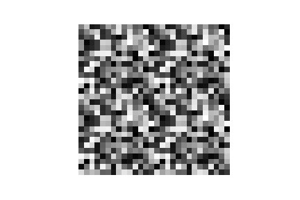
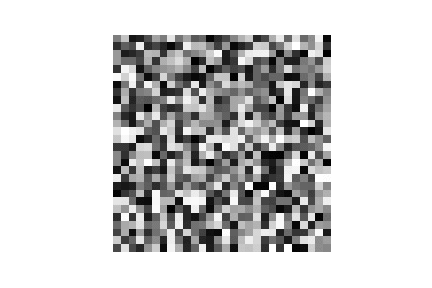

## Codes for CPL attacks

Client Privacy Leakage, or CPL is an advanced privacy leakage attack in federated learning which utilize the stolen gradient either during client's local training nor after the local training. While the context is in federated learning, the same problem holds in centralized setting too when the insider peeps the gradients saved at the checkpoint. The attack is an iterative process: 

There are a few unique properties of CPL:
- with geometric initilaizations like pattened seed or single-color seed, CPL attack is much faster than the SOTA DLG and GradInverting attack in terms of attack iterations, and better reconstruction quality in terms of both attack success rate and image quality. Besides the geometric initilization seed, CPL attack integrates the label attack given the fact the gradients on the training label class have the largest value so that the content attack is accerlerated compared to DLG. Detailed implementations can be found in <strong>./CPL/LFW_enhanced_random_ASR.ipynb</strong> 
- CPL attack can handle images larger than 64x64, which DLG claims impossbile to reconstruct from gradient. More details can be found in <strong> ./CPL/LFW128_enhanced_random_ASR.ipynb</strong> . The 64x64 setting is also provided as in <strong> LFW64_enhanced_random_ASR.ipynb</strong> .
- CPL attack can handle batch size up to 8 to attack the entire batch as a whole when there is, unlike DLG and GradInverting attack which can only attack single-input gradient in a batch one by one. More details can be found <strong>./CPL/LFW_batch.ipynb</strong> 
- CPL attack can work on Tanh and LeakyReLU in addition to Sigmoid, while existing approaches are studied only on Sigmoid. <strong> ./CPL/LFW_tanhrelu.ipynb</strong>
- We also provde initial solutions including gradien compression and additive Gaussian and Laplacian noise. See <strong> ./CPL/LFW_defense.ipynb</strong> for more details and tuning.
- To systematically defend the attack, federated learning with client-side differential privacy noise is proposed. See [code](https://github.com/git-disl/Fed-CDP) for gradient leakage resilient federated learning.


### Examples

|  | ours | DLG |
|:---:|:---:|:---:|
| MNIST|  |  |
| CIFAR10|  |  |
| LFW|  |  |


### Here is a brief description of each file in the DLG folder.

LFW_Deep_Leakage_from_Gradients.ipynb: lfw implementation for DLG attack in (NIPS2019) "Deep leakage from gradients."

### Here is a brief description of each file in the GradInversting folder.

Attack from NeurIPS 2020: Geiping, Jonas, Hartmut Bauermeister, Hannah Dröge, and Michael Moeller. "Inverting Gradients--How easy is it to break privacy in federated learning?." 
To run, you may find more details [here](https://github.com/JonasGeiping/invertinggradients)


The talk on the CPL attack can be found here:  <a href="https://www.youtube.com/watch?v=BNGpv4AW80g" target="_blank">talk</a>. Check out our [project page](https://git-disl.github.io/ESORICS20-CPL/).
If you use our code, please cite:

```
@inproceedings{wei2020framework,
  title={A framework for evaluating client privacy leakages in federated learning},
  author={Wei, Wenqi and Liu, Ling and Loper, Margaret and Chow, Ka-Ho and Gursoy, Mehmet Emre and Truex, Stacey and Wu, Yanzhao},
  booktitle={European Symposium on Research in Computer Security},
  year={2020},
  organization={Springer}
}

@inproceedings{wei2021gradient,
  title={Gradient-Leakage Resilient Federated Learning},
  author={Wei, Wenqi and Liu, Ling and Wu, Yanzhao and Su, Gong and Iyengar, Arun},
booktitle={International Conference on Distributed Computing Systems},
  year={2021},
  organization={IEEE}
}
...

